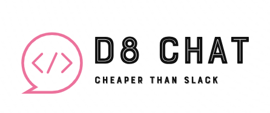

# d8-chat

DevOcho Chat is a modern, real-time collaboration hub built with Python, Flask, Peewee, HTMX, and WebSockets. It is designed to be a self-hostable, open-source alternative to platforms like Slack, Microsoft Teams, and Discord.

It was developed with ❤ by [DevOcho](https://www.devocho.com) as a showcase of our abilities. Feel free to hire us if you need custom software. We use this application in our company every day.

A companion mobile app is also under development.

## Features
- Real-time Messaging with Presence Indicators
- Public & Private Channels
- Direct Messaging (DMs)
- Threaded Conversations and Replies
- Emojis & Message Reactions
- Message Editing & Deletion
- File Uploads with Image Previews and Carousels
- Markdown Support & Code Snippets with Syntax Highlighting
- User Mentioning (@username, @channel, @here)
- Polls
- Desktop Notifications and Sounds
- Global Search (Messages, Channels, People)
- Single Sign-On (SSO) support via OIDC (e.g., Authentik, Keycloak)
- Dark/Light/System Theme Preference
- And more...

## Tech Stack
- **Backend:** Python, Flask, Gunicorn
- **Database:** PostgreSQL
- **ORM:** Peewee
- **Real-time Communication:** WebSockets, Valkey (Redis-compatible) for Pub/Sub
- **Frontend:** HTMX, Bootstrap 5, JavaScript
- **File Storage:** Minio (S3-compatible object storage)
- **Containerization:** Docker, Docker Compose

---

## Quick Start (production & development instructions below)

### Prerequisites
- [Git](https://git-scm.com/downloads)
- [Docker](https://www.docker.com/get-started)
- [Docker Compose](https://docs.docker.com/compose/install/)

### 1. Clone the Repository

```sh
git clone https://github.com/DevOcho/d8-chat.git
cd d8-chat
```

### 2. Configure Your Environment

First, copy the example environment file to create your own local configuration.

```sh
cp example.env .env.docker
```

Open `.env.docker` and set `SECRET_KEY`, `POSTGRES_PASSWORD`, and `MINIO_ROOT_PASSWORD`.

### 3. Build and Run

```sh
docker compose up --build -d
```

The application will be available at http://localhost:5001.

The initialization script creates a default `admin` user. The password will be printed in the Docker logs the very first time you start the application. You can view the logs by running: `docker logs <container_name_or_id>` (e.g., `docker logs d8-chat-app-1`).

## 🚀 Local Development (Quick Start)

This is the recommended setup for contributing to the project. It uses Docker Compose to manage background services (Postgres, Minio, Valkey) and a local Python virtual environment to run the Flask app. This provides the best debugging experience with terminal output and auto-reloading on code changes.

**Prerequisites:**
*   Python 3.12+
*   Docker

**1. Clone the Repository:**
```bash
git clone https://github.com/DevOcho/d8-chat.git
cd d8-chat
```

**2. Create and Activate a Python Virtual Environment:**
```bash
python3 -m venv .
source bin/activate
```

**3. Install Dependencies:**
```bash
pip install -r requirements.txt
```

**4. Configure Your Environment:**
Copy the example environment file. The default values are already configured for this local development setup.
```bash
cp example.env .env
```

**5. Start Background Services:**
In a **separate terminal**, start the database, file storage, and message broker using Docker Compose.
```bash
docker compose -f docker-compose.dev.yaml up
```
*(You can add `-d` to run them in the background, but seeing the logs is useful for debugging.)*

**6. Initialize the Database:**
This one-time command creates all necessary tables and generates an initial `admin` user and password.
```bash
python3 init_db.py --reset-db
```
```Important: Copy the admin password printed to the console!```

**7. Run the Flask Application:**
In your first terminal (with the virtual environment active), run the Flask development server.
```bash
flask run
```

**8. Access the Application:**
Open your browser and navigate to **[http://127.0.0.1:5001](http://127.0.0.1:5001)**. You can log in with the admin credentials from step 6. The server will auto-reload whenever you make changes to the Python code.

---

## 📦 Production Deployment (Docker Compose)

The `docker-compose.prod.yaml` file is configured to build and run the entire application stack in self-contained, production-ready containers.

**Prerequisites:**
*   A server with Docker and Docker Compose installed.
*   A domain name (e.g., `chat.yourcompany.com`) pointing to your server's IP address.
*   Ports 80 and 443 open on your server's firewall.

**1. Clone the Repository:**
```bash
git clone https://github.com/DevOcho/d8-chat.git
cd d8-chat
```

**2. Configure Your Production Environment:**
Copy the example environment file to `.env`. You **must** edit this file and set strong, unique values for your production deployment.
```bash
cp example.env .env
```
Now, edit the `.env` file and set the following variables:
*   `FLASK_SECRET_KEY`: Generate a long, random string.
*   `POSTGRES_PASSWORD`: Set a strong, unique password for the database.
*   `MINIO_ROOT_USER` & `MINIO_ROOT_PASSWORD`: Set strong credentials for the file storage admin.
*   `MINIO_PUBLIC_URL`: Set this to your public-facing URL, e.g., `https://chat.yourcompany.com`.

**3. Build and Run the Application:**
This command will build the main application image and start all services in detached mode.
```bash
docker compose -f docker-compose.prod.yaml up -d --build
```
*   `--build`: Builds the application image from the Dockerfile.
*   `-d`: Runs the containers in detached (background) mode.

The `entrypoint.sh` script will automatically run `init_db.py` on first start to create the database tables and the initial `admin` user.

**4. Find the Initial Admin Password:**
The randomly generated password for the `admin` user is printed to the logs the very first time the app container starts. To view it, run:
```bash
docker compose -f docker-compose.prod.yaml logs d8-chat-app
```
Look for the banner announcing the admin credentials.

**5. Set Up a Reverse Proxy for HTTPS:**
This Docker Compose setup exposes the application on a local port. **You should not expose this port directly to the internet.**

You must use a separate reverse proxy (like Nginx, Traefik, or Caddy) on your host machine to handle incoming traffic, manage SSL/TLS certificates (HTTPS), and forward requests to the Docker network.

*The `nginx.conf` and `init-letsencrypt.sh` scripts in the repository are provided as examples for a potential host-level Nginx setup with Let's Encrypt, but configuring a production reverse proxy is beyond the scope of this guide.*

### Managing the Production Stack

*   **Stopping the Application:**
    ```bash
    docker compose -f docker-compose.prod.yaml down
    ```

*   **Restarting the Application:**
    ```bash
    docker compose -f docker-compose.prod.yaml up -d
    ```

*   **Updating the Application:**
    To update to the latest version of the code:
    ```bash
    git pull
    docker compose -f docker-compose.prod.yaml up -d --build
    ```
